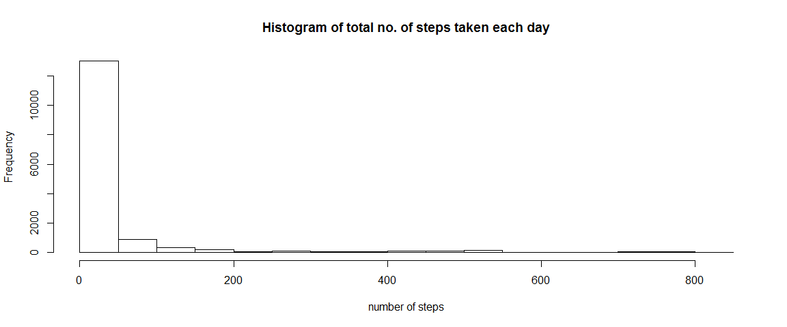
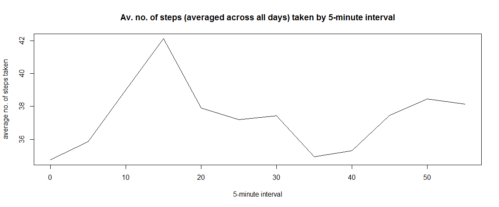

# Reproducible Research: Peer Assessment 1

## Loading and preprocessing the data

1. Load the data


```r
# assumes that the data is already downloaded and saved on system
setwd("E:/R-project/Coursera-notes")
activity <- read.csv("activity.csv", header=TRUE, colClasses=c("integer","POSIXct","integer"))
```

2. Process/transform the data (if necessary) into a format suitable for your analysis

Running the summary function on our activity variable shows us how many NAs there are


```r
summary(activity)
```

```
##      steps             date                        interval     
##  Min.   :  0.00   Min.   :2012-10-01 00:00:00   Min.   :   0.0  
##  1st Qu.:  0.00   1st Qu.:2012-10-16 00:00:00   1st Qu.: 588.8  
##  Median :  0.00   Median :2012-10-31 00:00:00   Median :1177.5  
##  Mean   : 37.38   Mean   :2012-10-30 23:32:27   Mean   :1177.5  
##  3rd Qu.: 12.00   3rd Qu.:2012-11-15 00:00:00   3rd Qu.:1766.2  
##  Max.   :806.00   Max.   :2012-11-30 00:00:00   Max.   :2355.0  
##  NA's   :2304
```

There are 2304 NAs in the steps variable

Let's create a copy of activity dataset but without the NAs


```r
activity1 <- na.omit(activity)
summary(activity1)
```

```
##      steps             date                        interval     
##  Min.   :  0.00   Min.   :2012-10-02 00:00:00   Min.   :   0.0  
##  1st Qu.:  0.00   1st Qu.:2012-10-16 00:00:00   1st Qu.: 588.8  
##  Median :  0.00   Median :2012-10-29 00:00:00   Median :1177.5  
##  Mean   : 37.38   Mean   :2012-10-30 16:43:01   Mean   :1177.5  
##  3rd Qu.: 12.00   3rd Qu.:2012-11-16 00:00:00   3rd Qu.:1766.2  
##  Max.   :806.00   Max.   :2012-11-29 00:00:00   Max.   :2355.0
```

```r
dim(activity1)
```

```
## [1] 15264     3
```

Our copy dataset, activity1, is a dataframe of 15264 observations and will enable us to for example, calculate the mean number of steps per day. 

## What is the mean total number of steps taken per day?

For this part of the assignment, you can ignore the missing values in the dataset.

**Therefore we'll use our activity1 dataset (without NAs)**

1. Calculate the total number of steps taken per day


```r
totalStep <- sum(activity1$steps)
totalStep
```

```
## [1] 570608
```
Result is 570,608 steps

2. Make a histogram of the total number of steps taken each day

```r
hist(activity1$steps)
```

 

3. Calculate and report the mean and median of the total number of steps taken per day

```r
mean(activity1$steps) # result is 37.3826
```

```
## [1] 37.3826
```

```r
median(activity1$steps) # result is 0
```

```
## [1] 0
```
Mean = 37.3826 and Median = 0

## What is the average daily activity pattern?

1. Make a time series plot (i.e. type = "l") of the 5-minute interval (x-axis) and the average number of steps taken, averaged across all days (y-axis)


```r
library(plyr)
activity1 <- mutate(activity1, hour=interval%/% 100, minute=interval%% 100)
avSteps <- ddply(activity1, .(minute), summarize, average=mean(steps))
plot(avSteps$minute, avSteps$average, type="l")
```

 

2. Which 5-minute interval, on average across all the days in the dataset, contains the maximum number of steps?


```r
avSteps[avSteps$average==max(avSteps$average),] # result is 15 minute interval
```

```
##   minute  average
## 4     15 42.11871
```
Answer is the 15 minute interval

## Imputing missing values

Note that there are a number of days/intervals where there are missing values (coded as NA). The presence of missing days may introduce bias into some calculations or summaries of the data.

1. Calculate and report the total number of missing values in the dataset (i.e. the total number of rows with NAs)


```r
sum(is.na(activity)) # result is 2304
```

```
## [1] 2304
```
Answer is 2,304 rows with NAs

2. Devise a strategy for filling in all of the missing values in the dataset. The strategy does not need to be sophisticated. For example, you could use the mean/median for that day, or the mean for that 5-minute interval, etc.

3. Create a new dataset that is equal to the original dataset but with the missing data filled in.

**I will use the mean for each 5 minute interval and the following code creates the new datasest with missing data filled in.**


```r
activity <- mutate(activity, hour=interval%/% 100, minute=interval%% 100)
activity2 <- merge(activity, avSteps, by.x="minute", by.y="minute")
activity2$steps[is.na(activity2$steps)] <- activity2$average[is.na(activity2$steps)] # replaces NA values in steps column with equivalent position in average column
summary(activity2)
```

```
##      minute          steps             date                    
##  Min.   : 0.00   Min.   :  0.00   Min.   :2012-10-01 00:00:00  
##  1st Qu.:13.75   1st Qu.:  0.00   1st Qu.:2012-10-16 00:00:00  
##  Median :27.50   Median :  0.00   Median :2012-10-31 00:00:00  
##  Mean   :27.50   Mean   : 37.38   Mean   :2012-10-30 23:32:27  
##  3rd Qu.:41.25   3rd Qu.: 35.86   3rd Qu.:2012-11-15 00:00:00  
##  Max.   :55.00   Max.   :806.00   Max.   :2012-11-30 00:00:00  
##     interval           hour          average     
##  Min.   :   0.0   Min.   : 0.00   Min.   :34.75  
##  1st Qu.: 588.8   1st Qu.: 5.75   1st Qu.:35.73  
##  Median :1177.5   Median :11.50   Median :37.45  
##  Mean   :1177.5   Mean   :11.50   Mean   :37.38  
##  3rd Qu.:1766.2   3rd Qu.:17.25   3rd Qu.:38.23  
##  Max.   :2355.0   Max.   :23.00   Max.   :42.12
```

4. Make a histogram of the total number of steps taken each day and Calculate and report the mean and median total number of steps taken per day. Do these values differ from the estimates from the first part of the assignment? What is the impact of imputing missing data on the estimates of the total daily number of steps?


```r
hist(activity2$steps)
```

 

```r
mean(activity2$steps) # result 37.3826
```

```
## [1] 37.3826
```

```r
median(activity2$steps) # result 0
```

```
## [1] 0
```

Answer: using the mean for each five minute interval has not changed the results from the first part of the assignment

## Are there differences in activity patterns between weekdays and weekends?

1. Create a new factor variable in the dataset with two levels - "weekday" and "weekend" indicating whether a given date is a weekday or weekend day.


```r
activity2$weekend <- weekdays(activity2$date)
activity2$weekend <- activity2$weekend %in% c("Saturday","Sunday") # creates a column showing if 
activity2$weekend <- factor(activity2$weekend, labels=c("weekday","weekend"))
summary(activity2)
```

```
##      minute          steps             date                    
##  Min.   : 0.00   Min.   :  0.00   Min.   :2012-10-01 00:00:00  
##  1st Qu.:13.75   1st Qu.:  0.00   1st Qu.:2012-10-16 00:00:00  
##  Median :27.50   Median :  0.00   Median :2012-10-31 00:00:00  
##  Mean   :27.50   Mean   : 37.38   Mean   :2012-10-30 23:32:27  
##  3rd Qu.:41.25   3rd Qu.: 35.86   3rd Qu.:2012-11-15 00:00:00  
##  Max.   :55.00   Max.   :806.00   Max.   :2012-11-30 00:00:00  
##     interval           hour          average         weekend     
##  Min.   :   0.0   Min.   : 0.00   Min.   :34.75   weekday:12960  
##  1st Qu.: 588.8   1st Qu.: 5.75   1st Qu.:35.73   weekend: 4608  
##  Median :1177.5   Median :11.50   Median :37.45                  
##  Mean   :1177.5   Mean   :11.50   Mean   :37.38                  
##  3rd Qu.:1766.2   3rd Qu.:17.25   3rd Qu.:38.23                  
##  Max.   :2355.0   Max.   :23.00   Max.   :42.12
```

2. Make a panel plot containing a time series plot (i.e. type = "l") of the 5-minute interval (x-axis) and the average number of steps taken, averaged across all weekday days or weekend days (y-axis). 


```r
# first get dataframe of averages by weekday/weekend
avStepsWk <- ddply(activity2, .(minute, weekend), summarize, average=mean(steps))

# now produce the plot
library(ggplot2)
qplot(x=minute, y=average, data=avStepsWk, facets=.~weekend, geom="line", ylab=c("Average number of steps"))
```

 

Resulting plot shows that on average activity levels are higher at the weekend than on weekdays, especially in the early part of the hour.
